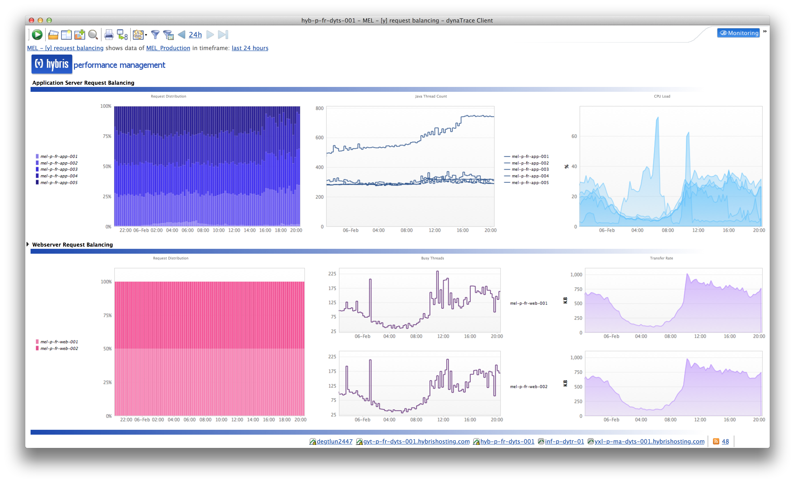
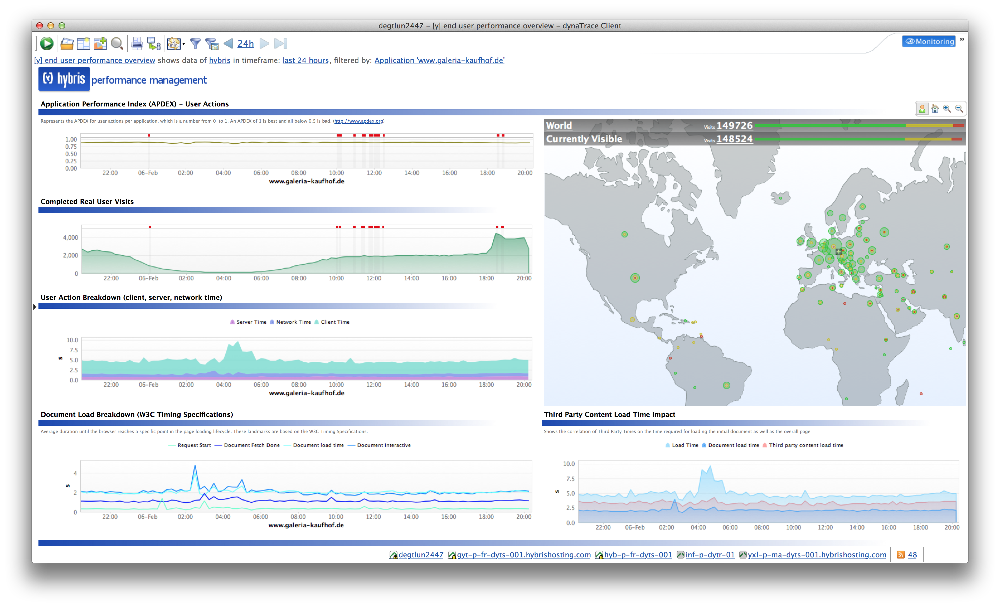
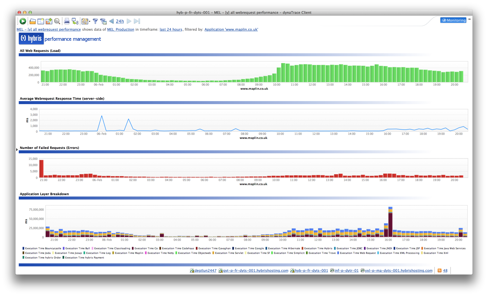
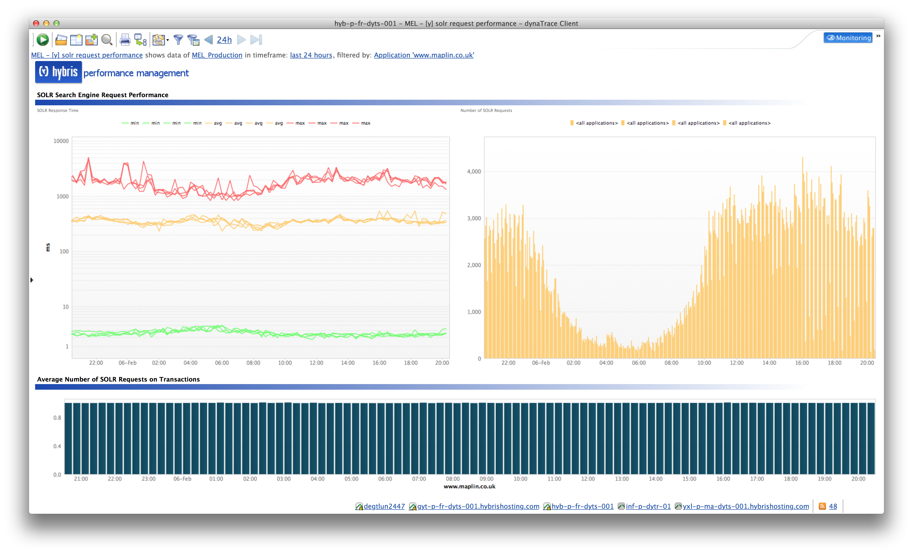
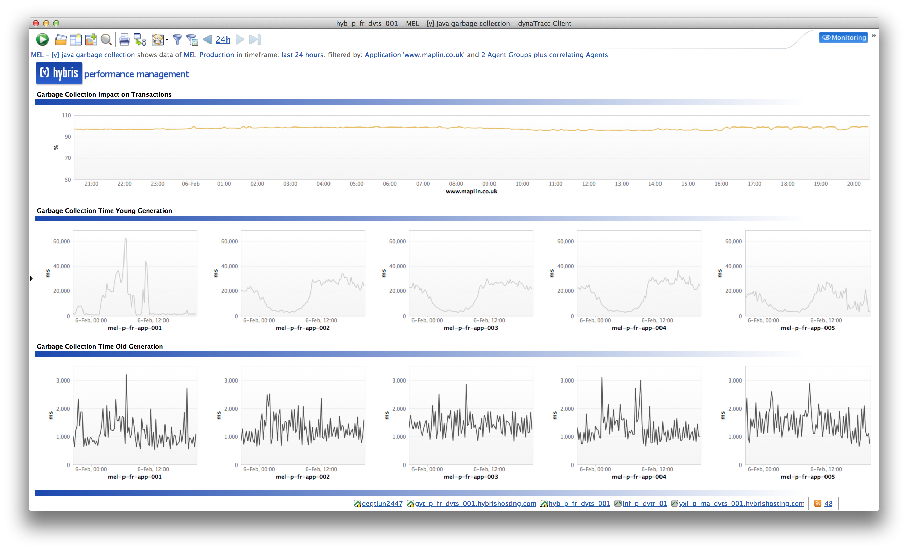
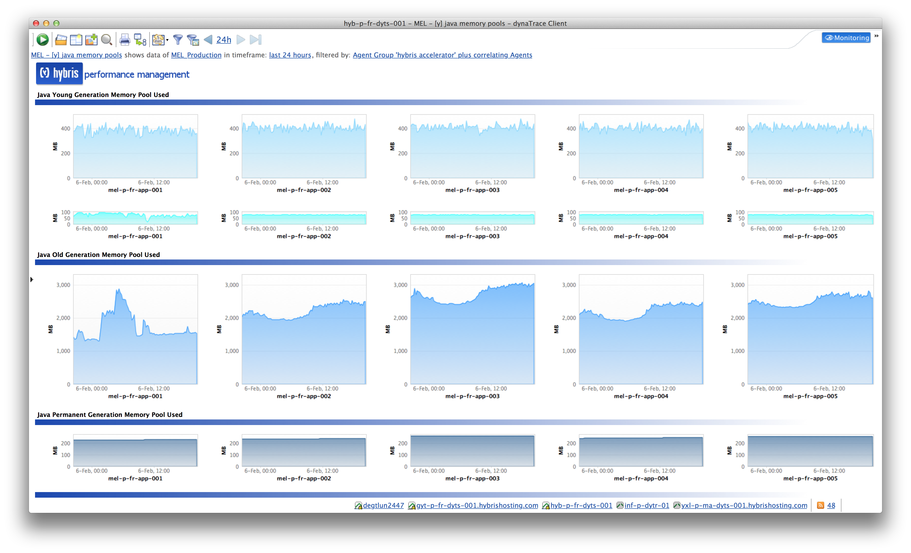
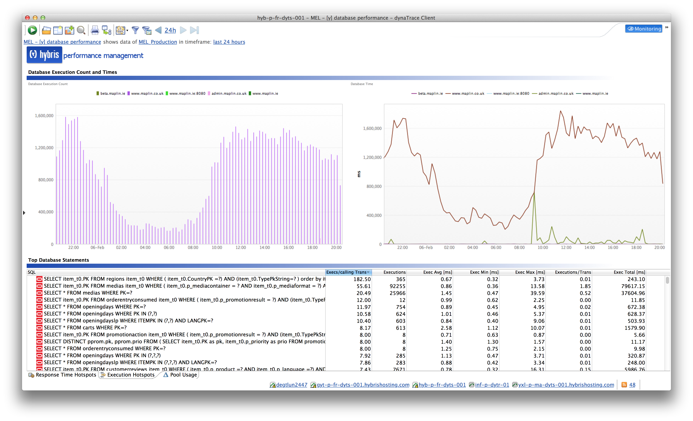
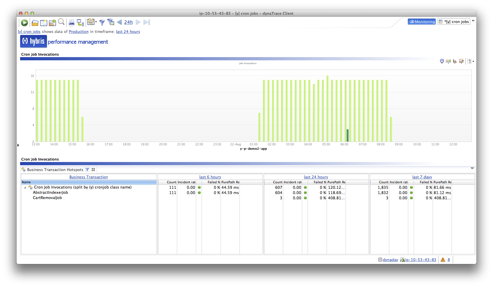
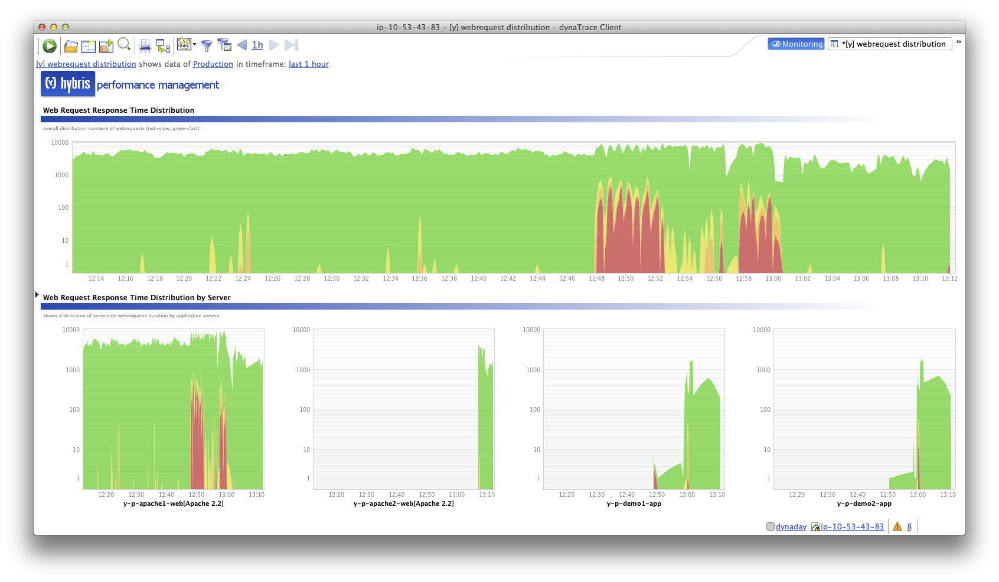
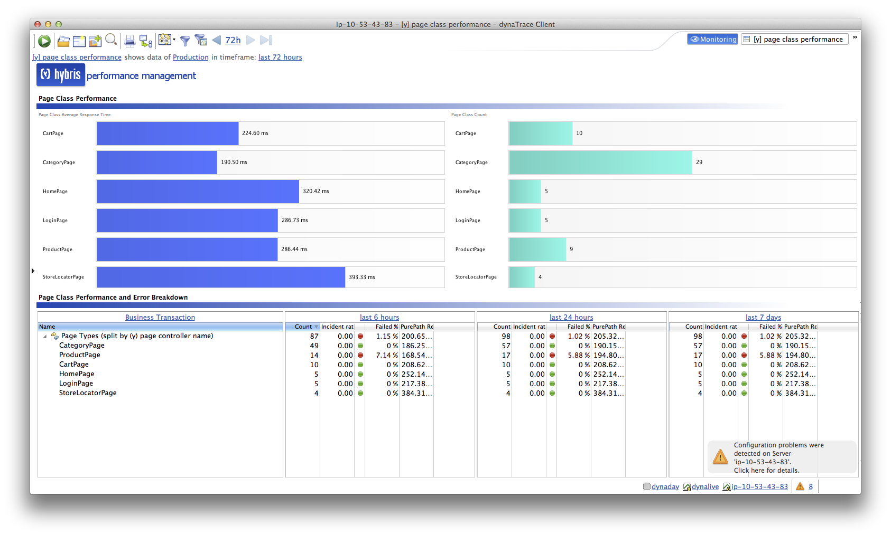

# hybris eCommerce Fastpack

## Overview

 The dynaTrace FastPack for hybris
contains sensors, a template system profile and dashboards for the hybris accelerator eCommerce platform. If you are using dynaTrace UEM you will also get conversion and visitor tagging.

## Fast Pack Details

| Name | hybris accelerator fastpack
| :--- | :--
| Supported dynaTrace Versions | 5.5, 5.6 (fastpack 2.0 only) >= 6.0 (fastpack 2.1) 
| Supported hybris Versions | hybris 4.5+ 
|Author|Reinhard Brandstaedter
|License |[dynaTrace BSD](dynaTraceBSD.txt)
|Support|[Community Supported ](https://community.compuwareapm.com/community/display/DL/Support+Levels#SupportLevels-Community)
| Release History | Version 2.1.0 
| Downloads | [fastpack 2.0](hybris-fastpack-2.0-public.dtp) (dynaTrace 5.x)  
| | [fastpack 2.1](hybris-fastpack-2.1.dtp) (dynaTrace >= 6.0)

Fastpack Download contains:

  * Dashboards (see below) 

  * Template Profile 

## Dashboards

**Request Balancing**  
Displays the distribution of requests among webservers and application servers. When you are running a hybris cluster make sure that all requests are equally balanced on both web and application
servers. This dashboard also shows the java thread count and CPU utilitzation of individual cluster nodes. Also shown is the busy workers for apache webservers and their transfer rate.

**End User Experience Metrics**  
End User Performance Overview provides insight on visits, 3rd party content load time and End User Action breakdown.

**Page Impressions and Webrequest Performance**

**SOLR Search Engine**  
Displays the response time and number of SOLR search queries that are made. Also shows the average number of calls to SOLR per transactions (too many unnecessary calls per transaction are usually a
hint that there is an architectural problem)

**Java Garbage Collection Health**  
The Garbage Collection Impact rate on transaction shows how affected transactions are by garbage collection runs. this measure should be as close to 100% as possible, meaning that garbage collection
does not negatively affect your users performance. Also shown are individual GC metrics for the hybris application servers.

**Java Memory Pools**  
An Overview of the different Java memory pools of you hybris cluster. Helps identifying if your memory sizing is OK and distributed equally (e.g. if single nodes are using more memory due to
background jobs)

**Database Utilization**  
Shows how many database statements are beeing issued and the overall time spent for database calls. Also displays the top database statements beeing executed. Long running database statements or too
many unnecessary database statements are often a root cause for low performance or slow server side response time.

**Cron Jobs**  
Shows the invocations of different cron Jobs and on which node they are executed

**Web Request Distribution**  
Shows the serverside response time distribution of all web requests. Color indicators are used for fast requests (green - faster than 1s), slower (yellow - between 1s and 3s), slow (orange between 3s
and 5s) and very slow requests (red - slower thatn 5s). This dashboard allows to get a very quick view on how the system is performing or if there are any changes or problems that impact the response
time.

**Page Class Performance**  
Different page handler classes are detected automatically and analyzed. This dashboard lists all detected page classes and displays their average server response time. Also shown is a trending of the
last 6 hours, lat day and last 7 days for the average response time and error rate.

## Installation

Just download and import the FastPack on your dynaTrace Server (see [Plugin Management](https://community.compuwareapm.com/community/display/DOCDT40/Plugin+Management)).  
Either configure your hybris agents' name to start with "hybris" so they will be mapped to the system profile contained in the fastpack, or copy the profile to match your application and modify the
contained agent groups and mappings.  
To use UEM you will need to match your webserver's agent name to the "webserver" agentgroup or adopt accordingly. Also make sure to enable the UEM and webserver sensor in the agent configuration
(disabled by default).

